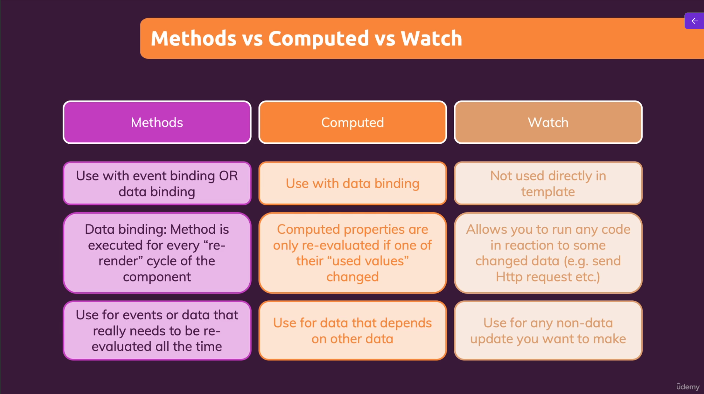

# Section 2: Basics & Core Concepts – DOM Interaction with Vue

A concise summary of the core concepts, directives, and patterns explored in Section 2 for interacting with the DOM using Vue 3.

---

## 📌 Key Concepts & Directives

### 1. Interpolation & Data Binding
- **Interpolation (`{{ expression }}`):** Outputs reactive data or simple JS expressions as plain text (escapes HTML).
- **`v-bind` (Shorthand: `:`):** Dynamically binds HTML attributes (e.g. `:href="vueLink"`, `:value="name"`).
- **`v-html`:** Renders raw HTML strings directly into the DOM. *(Use only with trusted content to prevent XSS).*
- **`v-once`:** Evaluates and renders an element/content once; skips updates on future re-renders.

### 2. Events & Event Modifiers
- **`v-on` (Shorthand: `@`):** Listens to DOM events (`@click="add(5)"`).
- **`$event`:** Special variable to pass the native DOM event object to a method (`@input="setName($event)"`).
- **Event Modifiers:** Declaratively handle event behaviors without manual boilerplate:
  - `.prevent` — Calls `event.preventDefault()` (e.g. `@submit.prevent="handleSubmit"`).
  - `.stop` — Calls `event.stopPropagation()` to stop bubbling.
- **Key & Mouse Modifiers:** Trigger handlers only on specific keys or buttons (`@keyup.enter="..."`, `@click.middle="..."`).

### 3. Two-Way Data Binding (`v-model`)
- `v-model` provides two-way reactive binding between form inputs and component state.
- **Under the Hood:** Syntactic sugar combining `:value="name"` (property binding) with `@input="name = $event.target.value"` (event listening).

---

## ⚖️ Methods vs. Computed vs. Watchers



| Feature | **Methods** (`methods`) | **Computed Properties** (`computed`) | **Watchers** (`watch`) |
| :--- | :--- | :--- | :--- |
| **Primary Use** | Event handlers or logic needing continuous re-evaluation | Derived/calculated reactive state | Reactive side effects (async, timers, HTTP) |
| **Template Binding** | Used in event bindings (`@click`) or called in interpolation | Referenced like regular data properties (`{{ fullName }}`) | Not used directly in templates |
| **Caching** | **No caching**; runs on every component re-render cycle | **Cached**; only re-evaluates when dependency state changes | Runs callback function when observed property changes |
| **Best For** | Triggering mutations, passing arguments on click/input | Data that depends on other data (e.g., full name calculation) | Non-data updates, HTTP requests, timers, logging |

---

## 🚀 Running the Project

```bash
npx nx serve section-2-dom-interaction
```
